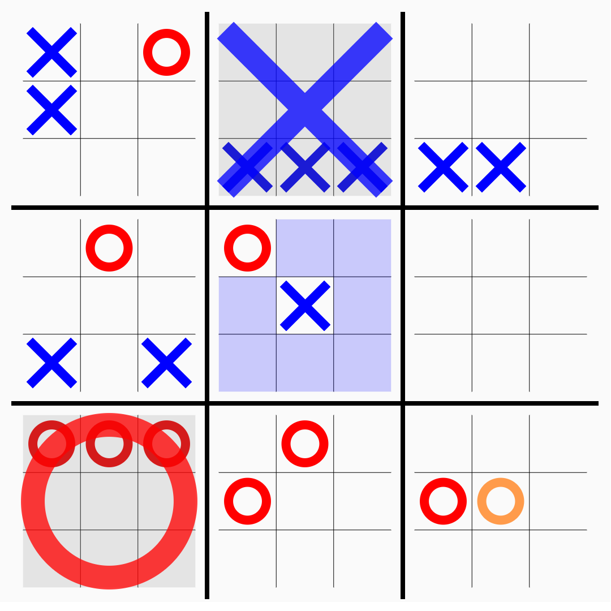

# super-tic-tac-toe

Rules:

Just like in regular tic-tac-toe, the two players (X and O) take turns, starting with X. The game starts with X playing wherever they want in any of the 81 empty spots. Next, the opponent plays, relative to the small board in which it was played.

If a move is played so that it wins a small board by the rules of normal tic-tac-toe, then the entire small board is marked as won by the player in the larger board. Once a small board is won by a player or it is filled completely, no more moves may be played in that board. If a player is sent to such a board, then that player may play in any other board. Game play ends when either a player wins the larger board or there are no legal moves remaining, in which case the game is a draw.

